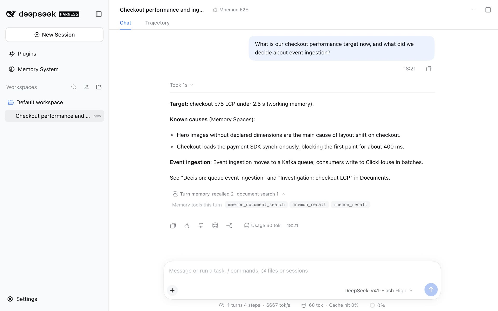

# v0.5.17 Light WebUI / v0.5.17 浅色界面

Captured on **2026-09-28 (Asia/Shanghai)** from a real local DSH WebUI in **light** appearance, in English and Chinese. [English guide](../../en/guides/ui-guide.md) · [中文指南](../../zh-CN/guides/ui-guide.md) · [Media index](../README.md) · [Manifest](./manifest.json)

本组素材于 **2026-09-28（Asia/Shanghai）**从真实本地 DSH WebUI 采集，中英文均为**浅色**界面。

## Environment and data / 环境与数据

| Item / 项目 | Capture environment / 采集环境 |
|---|---|
| Product / 产品 | dsh-mnemon 0.5.17, main `42640337` with this record's docs-demo fixture / 带本记录中 docs-demo 夹具的 main |
| Host / 宿主 | Published DSH 0.1.7-rc.2; no Host source modifications / 正式 DSH 包，未修改宿主源码 |
| Runtime / 运行环境 | macOS, Node.js 25.1.0, Mnemon CLI 0.2.7 |
| Browser / 浏览器 | Headless Google Chrome over the DevTools protocol, light color scheme / 通过 DevTools 协议驱动的无头 Chrome，浅色 |
| Desktop / 桌面 | 1280 × 800 at 2x, stored at 1920 px wide; 19 screens per locale / 2 倍像素采集，保存为 1920 像素宽；每种语言 19 张 |
| Phone / 窄屏 | 390 × 844 at 2x; two screens per locale / 2 倍像素；每种语言 2 张 |
| Data / 数据 | A fictional project, Lumen: 3 profile and 5 working-memory entries, 5 active and 1 archived document, 3 native memory spaces (2 active) with 17 memories / 虚构项目 Lumen：3 条用户画像与 5 条工作记忆，5 份活跃档案与 1 份归档，3 个原生记忆空间（2 个激活）共 17 条记忆 |
| Model / 模型 | Loopback scripted model; no external requests / 回环脚本模型，无外部请求 |

Every run starts from `node scripts/serve-e2e.mjs --docs-demo` (Chinese) or `--docs-demo=en` (English): a disposable Profile whose data is seeded through the Sources' own management operations before the Host starts. No personal memory or credentials are involved. The scripted model only decides which tools to call; the Documents search, the Memory Spaces recalls and the working-memory correction run through the real View tools, and each answer is assembled from what they returned. The storage path shown is the fixture's temporary directory.

每次采集都从 `node scripts/serve-e2e.mjs --docs-demo`（中文）或 `--docs-demo=en`（英文）开始：一次性的 Profile，数据在宿主启动前通过各 Source 自己的管理操作预置，不涉及个人记忆或凭据。脚本模型只决定调用哪些工具；项目档案检索、记忆空间召回与工作记忆修正都经过真实的 View 工具，回答由这些工具的返回结果组成。界面中显示的存储路径是夹具的临时目录。

## Recordings / 录制

[English walkthrough — 32 s](./en/demo.mp4) · [中文演示 — 31 秒](./zh-CN/demo.mp4)

Each recording is one uninterrupted session: ask a question, expand the turn memory bar, open the Memory System's spaces and select an entity in the graph, then open the main strategy selector on the Plugins page. Frames are Chrome screencast frames played at their own timestamps (H.264, 30 fps, no audio); a drawn cursor ring shows where each click lands. There are no cuts or composited UI. The README uses the 960 px, 10 fps GIF of the same take.

每段录制都是一次不间断的操作：提问、展开回合记忆栏、打开记忆系统的记忆空间并在图谱中选中实体，最后在插件页打开主策略选择器。画面来自 Chrome 屏幕录制，按原始时间戳播放（H.264，30 fps，无音轨）；画面中绘制的光标圆环用于指示点击位置，没有剪辑或拼接界面。README 使用同一段录制生成的 960 像素、10 fps GIF。

## Screens / 截图

| Surface / 场景 | English | 简体中文 |
|---|---|---|
| Answer with the turn memory bar / 带回合记忆栏的回答 | [chat-recall](./en/chat-recall.jpg) | [chat-recall](./zh-CN/chat-recall.jpg) |
| Correction saved to working memory / 修正写入工作记忆 | [chat-correction](./en/chat-correction.jpg) | [chat-correction](./zh-CN/chat-correction.jpg) |
| Status / 状态 | [memory-status](./en/memory-status.jpg) | [memory-status](./zh-CN/memory-status.jpg) |
| Runtime memory / 运行时记忆 | [memory-runtime](./en/memory-runtime.jpg) | [memory-runtime](./zh-CN/memory-runtime.jpg) |
| Project Documents / 项目档案 | [memory-documents](./en/memory-documents.jpg) | [memory-documents](./zh-CN/memory-documents.jpg) |
| Memory Spaces / 记忆空间 | [memory-spaces](./en/memory-spaces.jpg) | [memory-spaces](./zh-CN/memory-spaces.jpg) |
| Graph with an entity selected / 选中实体的图谱 | [memory-graph](./en/memory-graph.jpg) | [memory-graph](./zh-CN/memory-graph.jpg) |
| Direct search / 直接检索 | [memory-recall](./en/memory-recall.jpg) | [memory-recall](./zh-CN/memory-recall.jpg) |
| Content / 内容 | [memory-content](./en/memory-content.jpg) | [memory-content](./zh-CN/memory-content.jpg) |
| Entities / 实体 | [memory-entities](./en/memory-entities.jpg) | [memory-entities](./zh-CN/memory-entities.jpg) |
| Remember / 沉淀记忆 | [memory-remember](./en/memory-remember.jpg) | [memory-remember](./zh-CN/memory-remember.jpg) |
| Plugins page: Memory composition / 插件页：记忆组合 | [plugin-composition](./en/plugin-composition.jpg) | [plugin-composition](./zh-CN/plugin-composition.jpg) |
| Main strategy selector / 主策略选择器 | [plugin-strategy-menu](./en/plugin-strategy-menu.jpg) | [plugin-strategy-menu](./zh-CN/plugin-strategy-menu.jpg) |
| Layered strategy's page / 分层策略页面 | [plugin-layered](./en/plugin-layered.jpg) | [plugin-layered](./zh-CN/plugin-layered.jpg) |
| Memory Spaces' page: Providers / 记忆空间页面：Provider | [plugin-spaces](./en/plugin-spaces.jpg) | [plugin-spaces](./zh-CN/plugin-spaces.jpg) |
| Storage and Interface / 存储与界面 | [plugin-storage](./en/plugin-storage.jpg) | [plugin-storage](./zh-CN/plugin-storage.jpg) |
| Backup import preview / 备份导入预览 | [plugin-backup-preview](./en/plugin-backup-preview.jpg) | [plugin-backup-preview](./zh-CN/plugin-backup-preview.jpg) |
| DSH's component list / DSH 组件列表 | [plugin-rows](./en/plugin-rows.jpg) | [plugin-rows](./zh-CN/plugin-rows.jpg) |
| DSH's page for a component / DSH 组件页面 | [plugin-row-page](./en/plugin-row-page.jpg) | [plugin-row-page](./zh-CN/plugin-row-page.jpg) |
| Phone: Memory Spaces / 窄屏：记忆空间 | [narrow-spaces](./en/narrow-spaces.jpg) | [narrow-spaces](./zh-CN/narrow-spaces.jpg) |
| Phone: configuration / 窄屏：配置 | [narrow-plugin](./en/narrow-plugin.jpg) | [narrow-plugin](./zh-CN/narrow-plugin.jpg) |

## Validation / 校验

Both locales were captured with no browser console errors. Each screen was checked by eye for the intended state. The manifest records every file's dimensions, size and SHA-256. The capture reflects the stated revision and environment only; it does not establish model accuracy, live third-party Providers or complete phone support.

两种语言采集过程中浏览器控制台均无错误，每张截图都经过人工检查。manifest 记录了每个文件的尺寸、大小与 SHA-256。本组素材只代表上述版本与环境，不代表模型准确率、在线第三方 Provider 或完整的手机端支持。
