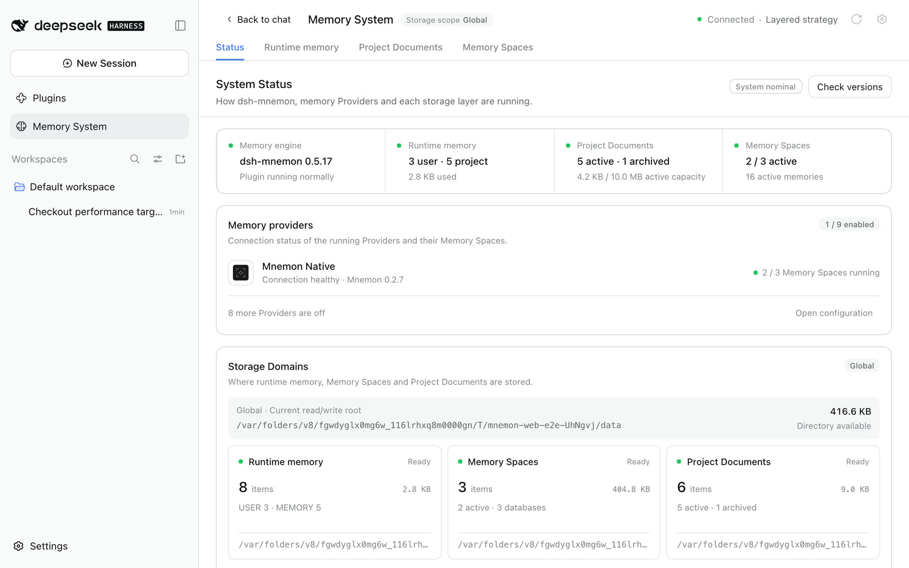
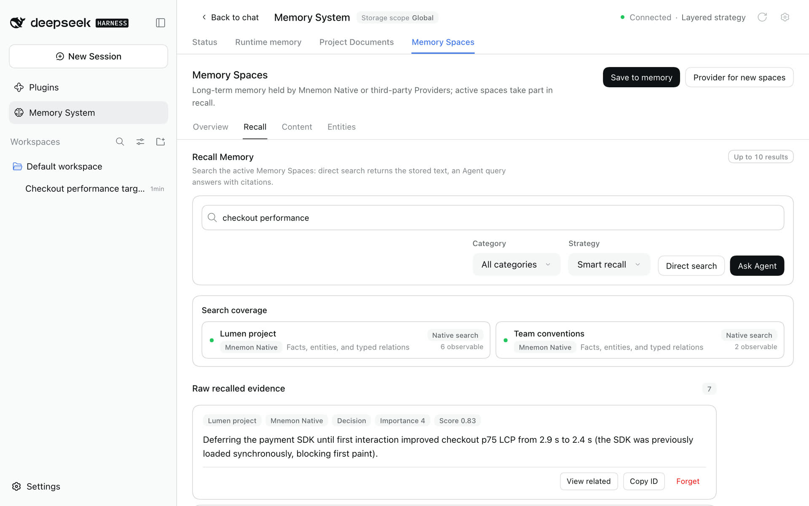

# Getting started

[简体中文](../../zh-CN/guides/getting-started.md) | **English** | [Documentation hub](../README.md)

This guide takes you from a blank environment to memory that a conversation actually uses. It keeps the defaults: the Memory System in the sidebar, global storage and the Layered strategy. You do not need to know about Views or Strategies for everyday use.

Already installed? Jump to [Open the Memory System](#4-open-the-memory-system). Upgrading? Follow [compatibility and upgrades](../reference/compatibility.md).

## 1. Prerequisites

- Node.js `^22.19.0 || >=24.0.0`, which the DSH 0.1.7-rc.2 profile requires;
- a DSH Web or Headless profile that starts;
- a DSH model route that can create independent task Agents;
- for Mnemon Native only, a local `mnemon` CLI. The other Providers connect to their own services.

Install and check the tested DSH release:

```sh
npm install -g @deepseek-ai/dsh@0.1.7-rc.2
dsh --version
npm view @deepseek-ai/dsh dist-tags
```

The Starter pins a tested combination of the official plugins; the [v0.5.17 release notes](../releases/v0.5.17.md) and the [compatibility matrix](../reference/compatibility.md) list it. Mnemon's Node 20 entry checks do not establish full Host compatibility.

<details>
<summary>How task Agents are started</summary>

Semantic work prefers a DSH provider named `spawn` with `toolFilter`, `persona` and `depthLimit`. Mnemon keeps one stable `mnemon_subagent_result` tool and issues a revocable `requestId` for each child. The child returns `{ requestId, result }`; the Host validates `result` against that operation's schema and rejects stale or foreign submissions. Optional background review defaults to a guarded `spawn` child with a bounded checkpoint; a full-context `fork` is opt-in. See [review compatibility and limits](../reference/configuration.md#provider-requirements).

</details>

## 2. Install the Mnemon CLI

Only Mnemon Native uses the Mnemon CLI. Skip this step if your Memory Spaces use another Provider; you can install it later. npm is recommended on macOS, Linux, and Windows (Node.js 22+). Run these commands on the machine running DSH:

```sh
npm install --global @mnemon-dev/mnemon@latest
mnemon --version
```

For later npm updates, run `mnemon update`, or use **Status → Check versions** when the page recognizes the owning npm installation. If migrating from Homebrew, Go, or a downloaded binary, put npm's global bin directory before the old command on PATH and update any `MNEMON_CLI_PATH` / `mnemon.cliPath` override. Restart DSH after changing its environment, then recheck the executable path on Status.

Homebrew Cask remains an alternative on macOS:

```sh
brew install --cask mnemon-dev/tap/mnemon
```

Go works on macOS and Linux:

```sh
go install github.com/mnemon-dev/mnemon@latest
```

Verify the binary:

```sh
mnemon --version
```

For a manual installation on Windows, the official release provides ZIP archives for AMD64 and ARM64. The following PowerShell installs v0.2.9 under the auto-discovered per-user Programs directory and verifies it against the published checksum:

```powershell
$version = '0.2.9'
$arch = if ([System.Runtime.InteropServices.RuntimeInformation]::OSArchitecture -eq 'Arm64') { 'arm64' } else { 'amd64' }
$archiveName = "mnemon_${version}_windows_${arch}.zip"
$releaseBase = "https://github.com/mnemon-dev/mnemon/releases/download/v${version}"
$archive = Join-Path $env:TEMP $archiveName
$checksumFile = Join-Path $env:TEMP "mnemon_${version}_checksums.txt"
Invoke-WebRequest "${releaseBase}/${archiveName}" -OutFile $archive
Invoke-WebRequest "${releaseBase}/checksums.txt" -OutFile $checksumFile
$line = Get-Content $checksumFile | Where-Object { $_.EndsWith("  $archiveName") } | Select-Object -First 1
if (-not $line) { throw "Checksum entry not found for $archiveName" }
$expected = (($line -split '\s+')[0]).ToLowerInvariant()
$actual = (Get-FileHash -Path $archive -Algorithm SHA256).Hash.ToLowerInvariant()
if ($actual -ne $expected) { throw "Checksum mismatch for $archiveName" }
$installDir = Join-Path $env:LOCALAPPDATA 'Programs\mnemon'
New-Item -ItemType Directory -Force -Path $installDir | Out-Null
Expand-Archive -Path $archive -DestinationPath $installDir -Force
$mnemon = Join-Path $installDir 'mnemon.exe'
& $mnemon --version
```

Go remains an alternative when a Go toolchain is already available:

```powershell
go install github.com/mnemon-dev/mnemon@latest
$mnemonBin = go env GOBIN
if (-not $mnemonBin) {
  $mnemonBin = Join-Path (((go env GOPATH) -split ';')[0]) 'bin'
}
$mnemon = Join-Path $mnemonBin 'mnemon.exe'
& $mnemon --version
```

On Windows, dsh-mnemon discovers native `mnemon.exe` from `PATH`, an exported `GOBIN` or `GOPATH`, the default `%USERPROFILE%\go\bin`, `%LOCALAPPDATA%\Programs\mnemon`, and Program Files. The official npm `mnemon.cmd` launcher is also supported: dsh-mnemon validates its package and invokes its JavaScript entry with Node, without a shell. Other `.cmd` and `.bat` wrappers remain unsupported.

When DSH runs inside an Electron desktop main process, verified npm launchers run with `ELECTRON_RUN_AS_NODE=1` in the child process. This covers memory commands, version checks, and npm updates, while preserving saved embedding settings. The desktop application's own environment is unchanged. If the shell disables Electron's `runAsNode` fuse, point `mnemon.cliPath` at the platform's native Mnemon binary instead; see [Troubleshooting](./operations.md#troubleshooting).

If DSH still cannot find the binary, set `MNEMON_CLI_PATH`, or set `mnemon.cliPath` as a user setting rather than replacing the plugin's profile patch (see [Configuration](../reference/configuration.md)):

```yaml
mnemon:
  cliPath: 'C:\Users\alice\AppData\Local\Programs\mnemon\mnemon.exe'
```

`mnemon status` opens the effective Store and may initialize data or run upstream migrations, so it is not a side-effect-free installation probe.

## 3. Install dsh-mnemon

Install into the Web profile for the complete workbench:

```sh
dsh plugin --profile web add dsh-mnemon
```

Use an absolute path for a development checkout:

```sh
dsh plugin --profile web add "link:/absolute/path/to/dsh-mnemon"
```

Then start or restart the profile:

```sh
dsh --profile web
```

If the Web profile is reached through a cloud hostname, do not publish port 3080 directly. DSH authenticates every Mnemon RPC and stream through a browser session established from the one-time URL printed at Host startup. Configure the HTTPS reverse proxy or access gateway and trusted authority together, then open that launch URL, by following [Cloud-hosted WebUI](./operations.md#cloud-hosted-webui).

Upgrade and uninstall:

```sh
dsh plugin --profile web update dsh-mnemon
dsh plugin --profile web remove dsh-mnemon
```

Uninstall removes the plugin registration, not memory data in global, workspace, or custom roots.

Profiles have independent plugin rosters. Install the package separately into Headless when one-shot tasks also need memory:

```sh
dsh plugin --profile headless add dsh-mnemon
dsh --profile headless "Check durable project context before answering this task."
```

For a development checkout, replace the package name with `"link:/absolute/path/to/dsh-mnemon"`. Headless mounts the same Runtime context, Documents, Memory Space tools, lifecycle guidance, and supervised write path as a Web Agent. It does not mount the workbench, conversation buttons, RPC channels, or an interactive slash-command surface.

With `storageScope=workspace`, Headless resolves `<invocation cwd>/.mnemon`; no Web workspace registry is required. The one-shot runner exits when its Agent becomes idle, so shutdown cancels any delayed score-based background review that has not started. Explicit or model-guided writes that finish during the task are durable.

## 4. Open the Memory System

Click **Memory System** in the sidebar. It opens on **Status**.



Check that:

- the header says **Connected** and names the main strategy, *Layered strategy* by default;
- the engine card shows the dsh-mnemon version, and the Mnemon CLI appears under **Memory providers** if you installed it;
- Runtime memory, Project Documents and Memory Spaces each have a card without errors;
- the storage root matches your storage scope.

Project Documents needs a DSH workspace even with global storage. Select a workspace for the conversation; "Waiting for workspace" means the project context is missing, not the CLI. If the Mnemon CLI is missing, run `command -v mnemon` and `mnemon --version` on macOS or Linux, or `Get-Command mnemon` on Windows. See [troubleshooting](./operations.md#troubleshooting) for other symptoms.

## 5. Store your first memories

**Runtime memory.** Open **Runtime memory**, choose **Add memory** and save a preference in the user profile or a project fact in working memory. It is injected into every later turn.

**A document.** Open **Project Documents**, choose **New document** and save a short design note or checklist. The Agent searches documents when a question needs them.

**A memory space.** Open **Memory Spaces → Overview** and choose **Create Memory Space**:

1. Pick a Provider. Mnemon Native, the local default, is offered once its CLI is installed; enable third-party Providers on [Memory Spaces' page](./ui-guide.md#on-the-plugins-page) first.
2. Give it a narrow name, such as *Project decisions*, and describe what belongs there.
3. Keep it active so conversations can read it.

In an empty storage root, the first Mnemon Native space uses Mnemon's `default` store id while keeping your name and description; spaces on other Providers get their own ids. Then choose **Save to memory**, enter something stable and secret-free, and choose **Send to task Agent**. An independent task Agent picks the space, removes duplicates and writes, and its receipt says where it went.

**Check it.** Open **Memory Spaces → Recall**, ask a concrete question and choose **Direct search**. Each result keeps its memory space, category, importance and score; copy its id when you need it.



You can also use conversation commands:

```text
/mnemon status
/mnemon recall <focused query>
```

## 6. Use memory in a conversation

Ask a question that depends on what you stored, and let the Agent decide whether it needs memory. After the reply:

- a **Turn memory** line appears if the turn used memory; expand it to see the documents and memories each tool read or wrote, and select one to open it where it lives;
- the brain mark under the reply is **Save to memory**: it opens an editable dialog, **Cancel** writes nothing, and sending it to the task Agent returns a receipt.


Ordinary conversation does not force recall. Current requests, repository files and live tool results outrank remembered history.

## 7. Choose how memory is composed

Open **Plugins → dsh-mnemon**, or the gear in the Memory System header.


- **Main strategy**: keep the **Layered strategy**, or choose the **General strategy** to offer every available source in one budget and let the model decide.
- **Memory sources**: Runtime memory, Project Documents and Memory Spaces, one switch each. Turning one off stops its context, tools and background work without deleting data.
- **Enhancements**: Active capture, Light context and Scoped composition are off by default; each works with either main strategy.
- **Storage**: Global (default) shares one directory; Workspace keeps each workspace's own `.mnemon`; Centralized keeps each workspace under one root. **Data directory** is Default or Custom. Changing either never moves existing data.
- **Interface**: open the Memory System in the sidebar or as a conversation tab, and turn the conversation controls on or off.

Switches and selectors apply at once; storage changes wait for **Apply**. The [UI guide](./ui-guide.md#on-the-plugins-page) covers every page, and [Configuration](../reference/configuration.md) lists the settings behind them.

## 8. Next steps

- Learn every page in the [UI guide](./ui-guide.md).
- Decide what belongs in runtime memory, documents or memory spaces with the [storage model](../reference/storage-model.md).
- Export your first ZIP backup and prepare for upgrades with the [operations guide](./operations.md).
- Connect a long-term backend with the [Provider guide](./memory-providers.md).
