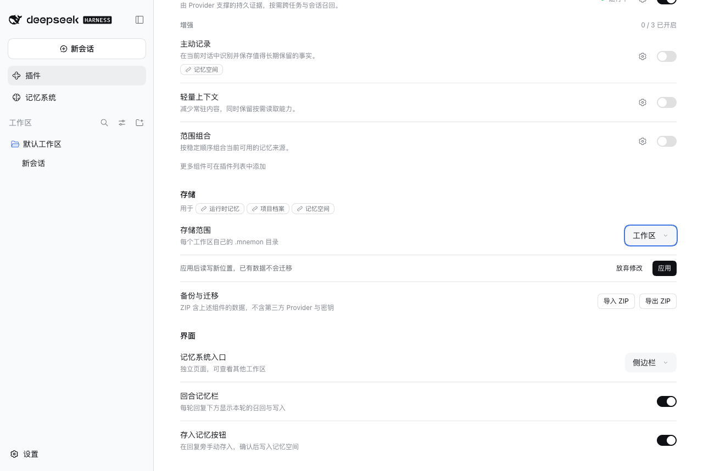
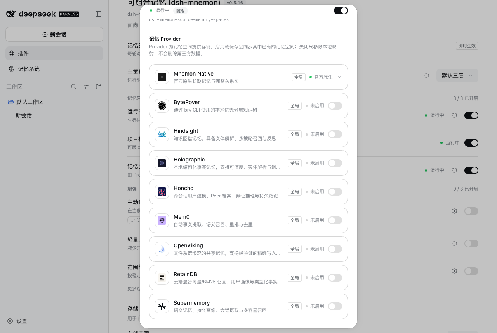
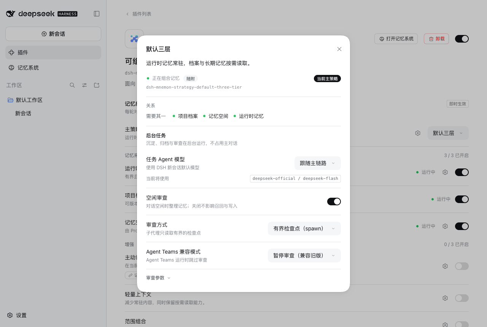
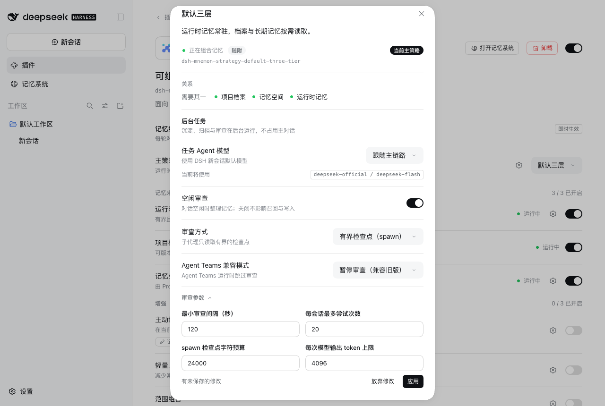
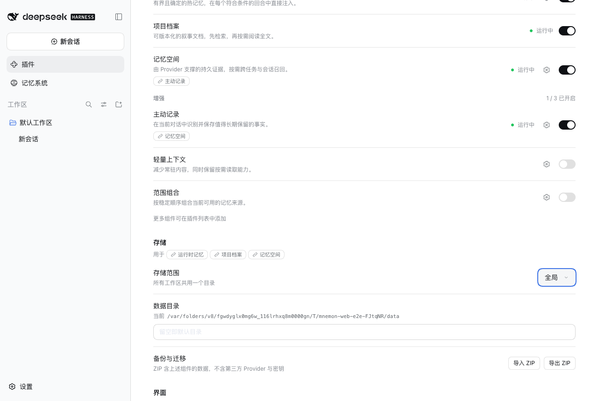
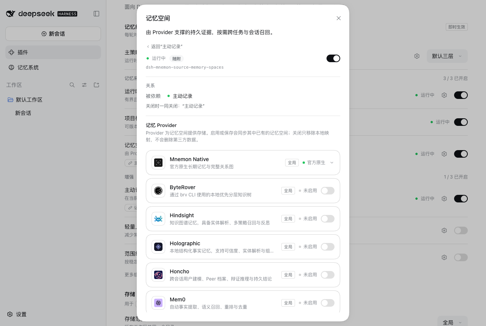
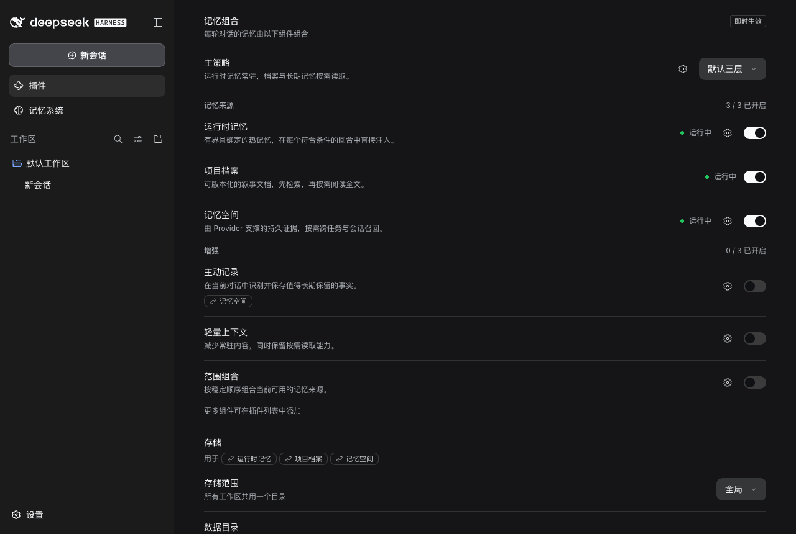
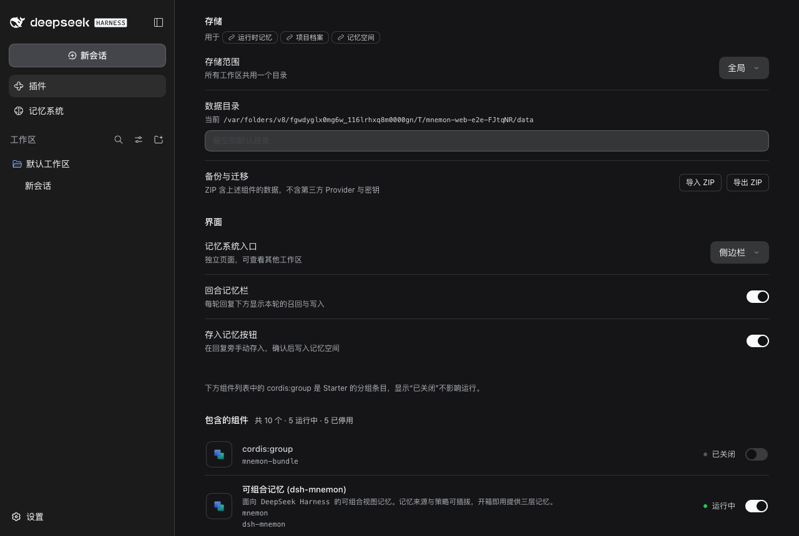
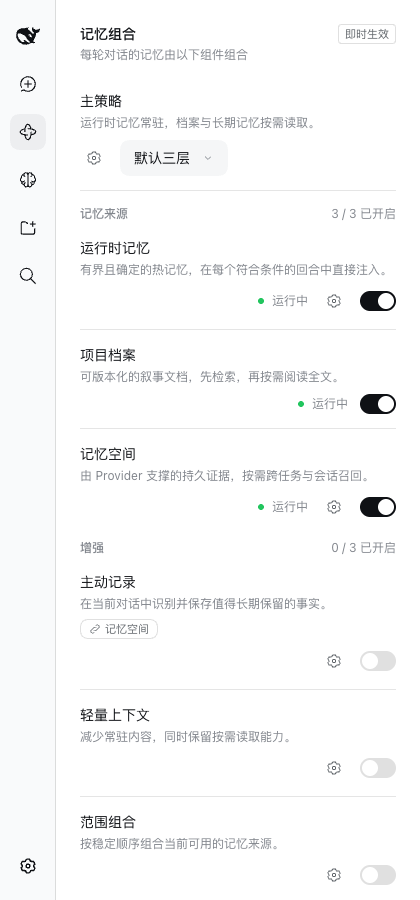
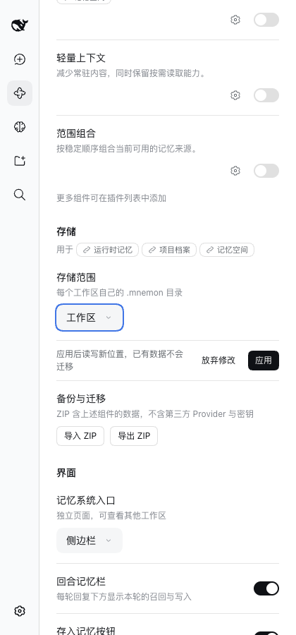

# Component pages and one interaction rule

[简体中文](./README.zh-CN.md)

Tested implementation: `41fced12`, stacked on the composition board record ([record](../composition-board-20260927/README.md)). macOS 15.6, Node 25.1.0, published DSH 0.1.7-rc.2, headless Chrome at 1280 × 860 (and 420 × 900). Each run walks an isolated WebUI fixture from the Starter's defaults with its test model. No personal memory or credentials were used.

## The configuration keeps what belongs to no component

A gear marks each component with settings of its own and opens its page; the main Strategy's gear opens the selected Strategy. Storage names the components that keep their data in its directory and shows where memory lives now. Interface choices apply at once.

| Board | Storage and Interface |
|---|---|
|  |  |

Moving the storage waits for its Apply, which says what applying does:

## Settings on their components' pages

| Runtime Memory: where USER.md lives | Memory Spaces: Providers and embedding |
|---|---|
|  |  |

| Default three-tier: background tasks | Review limits wait for their Apply |
|---|---|
|  |  |

## Names open pages

| Relation chips on rows | A related name opens in place, with Back |
|---|---|
|  |  |

Declared options show Apply once one changes:

## Dark theme and narrow column

| Board | Storage and Interface | Review limits |
|---|---|---|
|  |  |  |

| Board, 420 px | Storage Apply, 420 px | Review limits, 420 px |
|---|---|---|
|  |  |  |

## Verification

- Unit tests cover the settings region (registration, release, directory), the shipped panels (Runtime Memory's profile scope, Memory Spaces' managed switch and connection, Default three-tier's route, review choices and limits), storage Apply with legacy keys retired, interface choices at once with a refused write shown and reverted, gears, names, relation chips and Back on the board, declared options with Apply, and the dialog's box model.
- Full `pnpm run verify` and `pnpm run release:intent` passed; the package budget records the measured growth.
- WebUI: 10 light, 3 dark and 3 narrow states captured by a scripted walk with no console errors; the same flows were driven by hand in the in-app browser, including an idle review choice written to the real Host and a refused nested write caught before the fix.

## Limits

DSH's own component list below the configuration still names rows by package; giving its rows the same component pages through `plugins.row.config` is a later change. The Memory System still names its tabs and status cards from the shipped layers; moving them to component declarations and contributed cards is also later.
