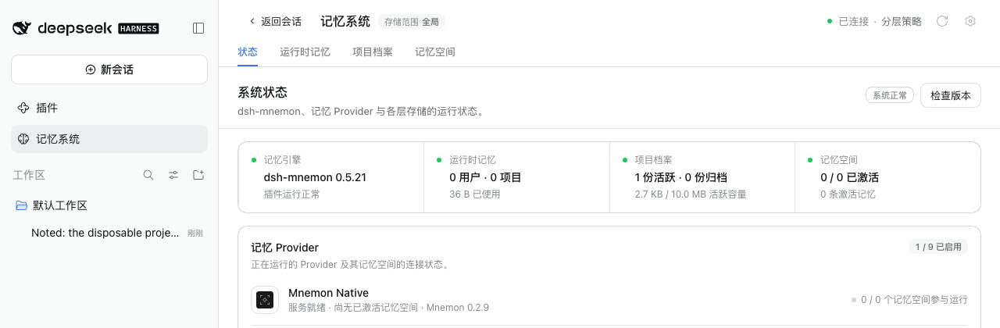
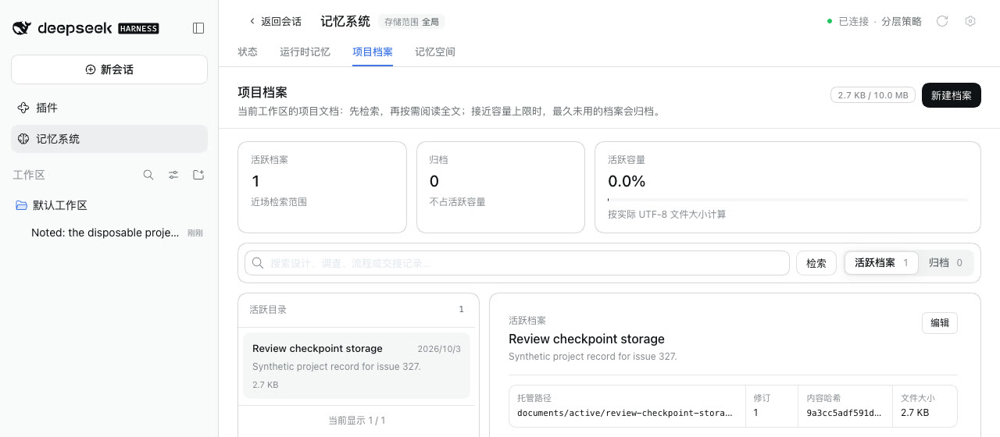

# Memory subagents and chat templates that require a user query — issue #327

[简体中文](./README.zh-CN.md) | [Verification data](./verification.json)

Issue [#327](https://github.com/omdsh-dev/dsh-mnemon/issues/327) reports a local model behind Ollama 0.33 whose chat template requires a user query, as Qwen3.x does. Idle review failed at its fourth request with `500 no user query found in messages`, after it had already created a Document.

Baseline: `main` `06182f4d`, the published dsh-mnemon 0.5.21. Fix: `b0dc3c7ea684fcd17f2556482b9a3239e57af250`. The runs took place on 2026-10-03 (Asia/Shanghai):
- macOS 15.6 arm64 and Node 24.19.0;
- headless Chrome 154 at 1280×800, zh-CN, light;
- DSH 0.1.7-rc.2, the version in the report, and 0.2.0-rc.2.

This machine has no Ollama or Qwen model, so a loopback model stub plays the server. DSH, Mnemon and the browser are real, no model is called, and all memories are synthetic.

## Cause

- A Mnemon memory subagent, such as idle review or remember, has one user turn: its delegated prompt. Each later step adds an assistant tool call and its results.
- Ollama 0.33 renders the system prompt plus the longest suffix of the other messages that fits `num_ctx`, always keeping the last message. Once tool results fill the window, that suffix starts after the prompt.
- A template that requires a user query then fails, and Ollama answers 500 `no user query found in messages` ([ollama/ollama#18303](https://github.com/ollama/ollama/issues/18303)). The truncation fix, [ollama/ollama#18697](https://github.com/ollama/ollama/pull/18697), is not released.
- DSH's own context compaction is not involved: it replaces the range it compacts with a user-role summary.

## The emulation

The stub behaves as Ollama 0.33 does:
- it truncates as above, estimating tokens as the JSON length divided by 4;
- it answers 500 when no user text turn survives.

Its window is sized when the review sends its third request, to hold that request from the delegated prompt on. One more tool round then overflows it at the fourth request, as in the report. Only the model's choices are scripted: search Documents, create a Document, search again, finish.

## Before (main)

On both hosts:
- requests 1 to 3 kept the prompt;
- request 4 kept only tool messages, and the server answered 500. DSH retried it five times and got the same answer each time;
- Status showed 后台审查失败 with `memory subagent stopped with error: SERVER: no user query found in messages`, and the committed `mnemon_document_create · created` receipt. This is the "written, then failed" case in the report.

## Fix

Every delegated child gets an `agent/pre-step` handler while DSH publishes it. From the second step on, a step without user text ends with a short Mnemon user turn: `Continue from the tool results above.` The server always keeps the last message, so every request keeps a user query however much it truncates.

The first step, which carries the prompt, is unchanged, and so is the main conversation. A step that already brings user text, such as a steer, gets nothing more.

| After: Status | After: the Document the review created |
|---|---|
|  |  |

On both hosts the fourth request still lost the prompt to truncation, but it ended with the continuation turn and succeeded on the first try. Status read 系统正常 with no review failure, and Project Documents showed the Document. No run logged a console error.

## Request by request

The in-process composition, for fork and spawn reviews alike:

| Request | Main: last message | Main: user query | Fix: last message | Fix: user query | Prompt kept |
|---|---|---|---|---|---|
| 1 | DSH runtime context (user) | yes | DSH runtime context (user) | yes | yes |
| 2 | tool result | yes | continuation turn (user) | yes | yes |
| 3 | tool result | yes | continuation turn (user) | yes | yes |
| 4 | tool result | **no: 500** | continuation turn (user) | yes | no |

The WebUI runs on both hosts match this table.

## Automated checks

- `tests/review-user-turn-host.spec.ts` runs a real DSH 0.1.7-rc.2 composition in process with the emulation: agent loop, fork and spawn providers, and Mnemon's lifecycle, coordinator and tools.
  - On main, both reviews fail with the reported error and a partial receipt.
  - With the fix, both create the Document and every request keeps a user query. The parent conversation gets no continuation turn.
- `tests/continuation-turn.spec.ts` covers the handler:
  - it adds the turn only to a continuation step without user text;
  - it leaves a first step, a rejected or aborted step, and a step with user text unchanged;
  - it attaches only to the child that its own start creates under the parent, even when starts overlap;
  - it releases what it attached when the start fails or the run ends.
- `tests/subagent.spec.ts`: a delegated write child gets the same handler.
- `pnpm run verify` passes on the fix: docs (2,979 local links), typecheck and the deterministic build, build, typecheck and tests for all 17 plugins, root tests (115 files, 1,567 passed, 6 skipped), Headless activation, package contents (1,501,839 unpacked bytes, with the budget moved to 1,504,000), public entries, publint and attw.

## Limits

- The server is an emulation of Ollama 0.33, built from its published behavior (ollama/ollama#18303 and #18697), not Ollama with a Qwen model. The token estimate is coarse, and the window is sized during the run so that the overflow lands on the fourth request, as reported.
- Truncation still drops older context, including the prompt. The continuation turn keeps each request valid. A larger Ollama context length (`OLLAMA_CONTEXT_LENGTH` or the model's `num_ctx`) keeps the whole review in view.
- The main conversation belongs to DSH and is unchanged; the report found no failures there.
