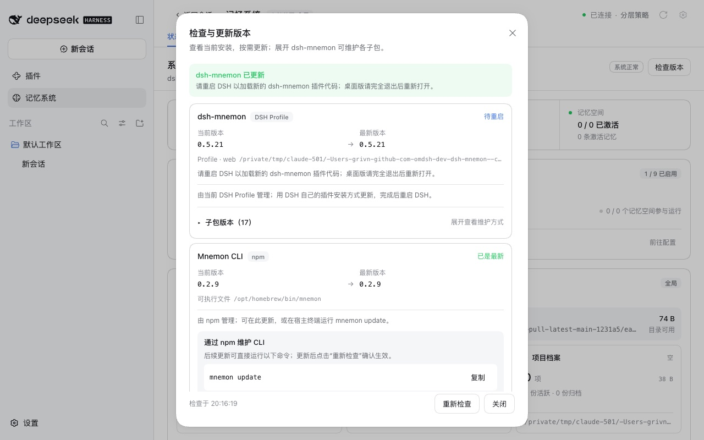
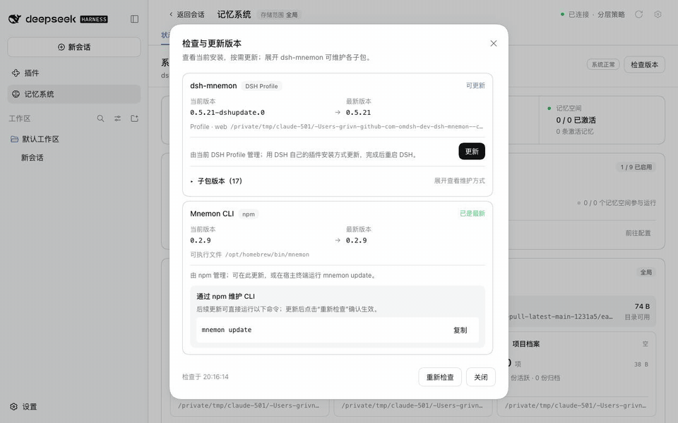

# One-click update in the desktop app

[简体中文](./README.zh-CN.md) | [Verification data](./verification.json)

In the desktop app, **Status → Check versions** found a newer dsh-mnemon but could not update it. The dialog only said 检测到 DSH Profile 安装，但当前找不到 pnpm 命令。, because the version check ran pnpm from PATH and the app's Host has none. The app ships its own pnpm and hands it to DSH's plugin manager. With this change the Starter updates through that plugin manager, so the app's own pnpm installs it. After DSH swaps in the new page, the Memory System reopens on the result.

Tested revision: `b6e463569103c8380d6159ee4108e20d505a8da1`. Baseline: dsh-mnemon 0.5.20 from npm. The runs took place on 2026-10-02 (Asia/Shanghai):
- macOS 15.6 arm64 and Node 24.19.0;
- headless Chrome 154 at 1280×800, zh-CN, light;
- a fresh home, DSH home and pnpm store for each run.

Profiles and memories are synthetic.

## How the desktop app was reproduced

The installed DeepSeek Harness app (0.2.0-rc.2) starts its Host with `runProfile({ packageManager })`. That `packageManager` runs `Contents/Resources/runtime/pnpm/bin/pnpm.mjs` with the app's own executable, and DSH's plugin manager uses it instead of a PATH pnpm.

These runs start npm DSH 0.2.0-rc.2 the same way:
- a small launcher calls DSH's exported `runCli({ packageManager })` with a copy of the app's pnpm 11.7.0;
- the Host gets the app Host's own PATH, which has no pnpm.

The app itself was not driven: it owns a fixed port and the user's profile, and its files were only read.

## Before: published 0.5.20

The row reads 可更新 0.5.20 → 0.5.21 with 检测到 DSH Profile 安装，但当前找不到 pnpm 命令。 and no **Update** button, as reported.

## After: update, reopen, restart

A loopback registry serves npm's real metadata plus this revision's Starter twice:
- as `0.5.21-dshupdate.0`, installed first;
- as `0.5.21`, in place of npm's 0.5.21.

The version check reads npm's own `latest`, 0.5.21, so the dialog offers that update. Serving this revision as 0.5.21 lets the update land on a page that contains this change, as an update from this release to a later one will.

| Offered | Updating |
|---|---|
|  |  |

| Reopened with the result | After a restart |
|---|---|
|  |  |

1. The dsh-mnemon row reads 由当前 DSH Profile 管理；用 DSH 自己的插件安装方式更新，完成后重启 DSH。 with **Update**.
2. DSH's plugin manager ran `pnpm add dsh-mnemon@0.5.21` with the app's pnpm, and the profile's log ends `Done in 384ms using pnpm v11.7.0`. The profile now lists `"dsh-mnemon": "0.5.21"` and its node_modules holds 0.5.21. The enabled bundles are unchanged.
3. 1.64 s after the update request, the page fetched dsh-mnemon's new `client.js` revision, then the components' clients. DSH's client HMR had swapped in the new page, while the Host kept running the old code.
4. The new page reopened Status and **Check versions**. By 3.75 s the dialog showed **dsh-mnemon 已更新** with the restart notice, and the row read 待重启 · 0.5.21.
5. After DSH was stopped and started again, Status reads dsh-mnemon 0.5.21 / 系统正常. The dialog reads 已是最新, with no restart notice and no **Update** button.

## Why the page reopens

DSH's shipped Web composition, which the desktop app also runs, includes `dsh-client-hmr`. It polls each plugin's `lib/client.js` and swaps a changed plugin into open pages, which drops the plugin's React state. An in-place update changes the Starter's files, so the Memory System and its dialog used to close about two seconds after the click, often before the update reported back. The pnpm route behaved the same way.

With npm's real 0.5.21 as the target, whose page lacks this change, the update installed npm's tarball, and its integrity matches npm's. The page then showed DSH's home without the Memory System at 2.5 s.

Now the dialog records a Starter update in the page's session storage before it starts:
- the page DSH swaps in reopens the Memory System, and Status reopens the dialog;
- the dialog shows the result once the Host reports the restart that version needs;
- the Host's version check waits up to 3 s for an update that is still finishing, so the reopened dialog sees how it ended.

## DSH 0.1.7-rc.2

DSH 0.1.7-rc.2's CLI entry takes no package manager from a launcher, so its plugin manager runs pnpm from PATH. This run used `dsh web` with pnpm 11.19.0 on PATH:
- the update went through DSH's plugin manager (`Done in 562ms using pnpm v11.19.0`);
- the new page arrived 2.42 s after the request, and the dialog reopened with the result by 3.70 s;
- after a restart, the dialog read 已是最新.

## Without any package manager

Here npm DSH 0.2.0-rc.2 was started directly with `dsh web`, without a launcher and without pnpm on PATH, so DSH's own Plugins page cannot install either. The row reads 可更新 with 检测到 DSH Profile 安装，但宿主找不到 pnpm 命令；安装 pnpm 并重启 DSH 后即可在此更新。, and there is no **Update** button.

## An optional Strategy added on its own

| Offered | Updated |
|---|---|
|  |  |

`dsh-mnemon-strategy-scoped@0.5.4` from npm was added with the packaged-app `dsh plugin add`. It is a DSH bundle the profile maintains (Profile 独立维护). Its **Update** went through DSH's plugin manager to npm's 0.5.5 (`Done in 267ms using pnpm v11.7.0`). Only the Strategy's page changed, so the dialog stayed open, and the enabled bundles were unchanged.

## Automated checks

`pnpm run verify` passes on the tested revision. It covers:
- docs (2,965 local links), typecheck and the deterministic build;
- build, typecheck and tests for all 17 plugins;
- root tests: 113 files, 1,578 passed, 6 skipped;
- Headless activation and public entries, publint and attw;
- package contents at 1,506,720 unpacked bytes, with the budget moved to 1,509,000.

New Host tests cover:
- DSH's route without a PATH pnpm, and its preference over one;
- the exact spec with `enabled: false`;
- never another profile;
- the pnpm route without a plugin manager, and no update without any package manager;
- DSH's route with a PATH pnpm where the launcher supplies none;
- failure reasons: the first diagnostic line, the DSH an incompatible release needs, and an installer that throws;
- a version mismatch, and a check that waits for a finishing update;
- a Strategy bundle through DSH while a package that is not a bundle stays with pnpm.

New Client tests cover:
- the record: written for a Starter update, kept on success, cleared on close or failure, never written for the CLI;
- the reopened dialog, which shows the outcome the Host reports and claims nothing else;
- reopening the workspace only for a fresh record;
- Status reopening the dialog in the workbench.

## Limits

- The desktop app was reproduced with npm DSH 0.2.0-rc.2 through the same `packageManager` contract and a copy of the app's pnpm. The packaged app itself was not driven.
- The Starter updates on 0.2.0-rc.2 and 0.1.7-rc.2 install this revision served as 0.5.21, so the swap can be shown without a newer release. Another run installs npm's real 0.5.21, whose page lacks the reopening.
- The reopening starts with updates from the release that contains this change. On 0.5.21 or earlier, the desktop app needs one removal and reinstall on its Plugins page, as the guides say.
- The live runs use the default sidebar layout. The builtin layout reopens through the same workspace opener, which unit tests cover.
- Without session storage the update still works; only the reopening is lost.
