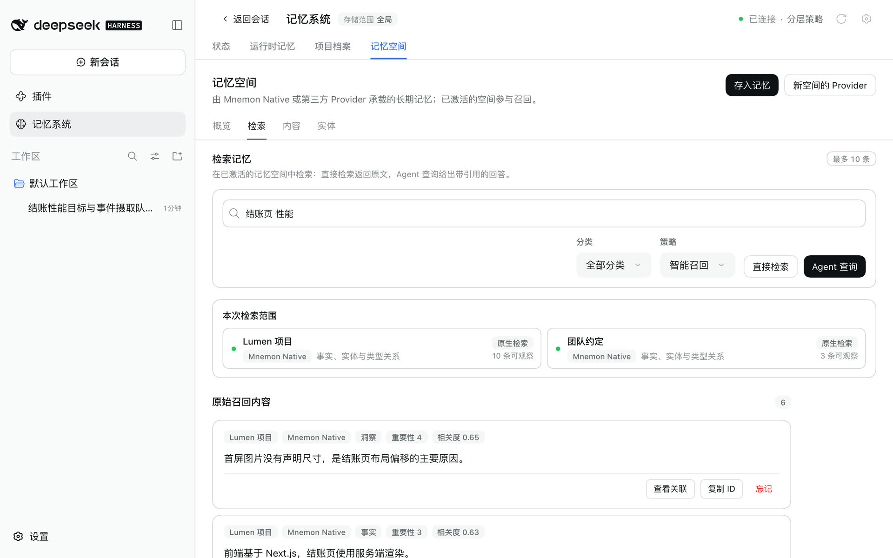
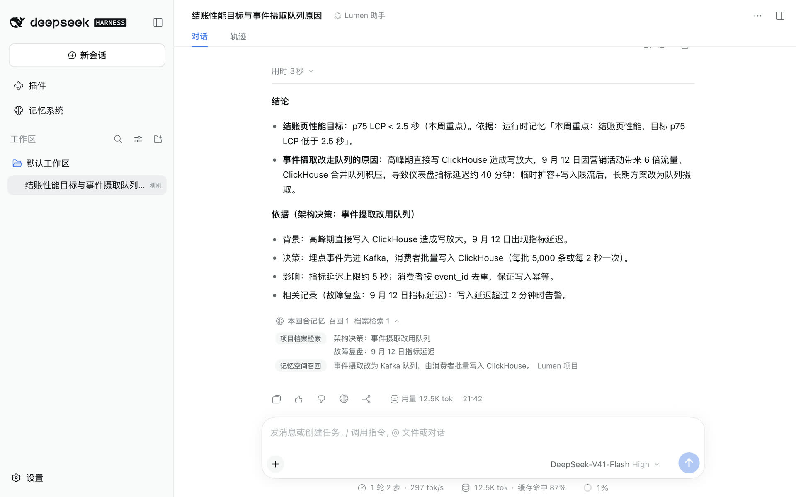

# 快速开始

**简体中文** | [English](../../en/guides/getting-started.md) | [文档中心](../README.md)

本页从空白环境开始，一直走到对话真正用上记忆。全程使用默认设置：记忆系统位于侧栏、全局存储、分层策略。日常使用不需要了解 View 或 Strategy。

已经安装好了？直接跳到[打开记忆系统](#4-打开记忆系统)。准备升级？请按[兼容性与升级](../reference/compatibility.md)操作。

## 1. 前置条件

- Node.js `^22.19.0 || >=24.0.0`，这是 DSH 0.1.7-rc.2 profile 的要求；
- 一个可以启动的 DSH Web 或 Headless profile；
- 一个能够创建独立任务 Agent 的 DSH 模型路由；
- 仅在使用 Mnemon Native 时需要本地的 `mnemon` CLI，其他 Provider 连接各自的服务。

安装并核对经过测试的 DSH 版本：

```sh
npm install -g @deepseek-ai/dsh@0.1.7-rc.2
dsh --version
npm view @deepseek-ai/dsh dist-tags
```

Starter 固定一组经过测试的官方插件组合，详见 [v0.5.17 发布说明](../releases/v0.5.17.md)与[兼容性矩阵](../reference/compatibility.md)。Mnemon 的 Node 20 入口检查不代表完整的 Host 兼容。

<details>
<summary>任务 Agent 如何启动</summary>

语义任务优先使用名为 `spawn` 的 DSH Provider，并要求 `toolFilter`、`persona` 与 `depthLimit`。Mnemon 固定注册一个 `mnemon_subagent_result` 工具，并为每个子任务签发可撤销的 `requestId`。子任务返回 `{ requestId, result }`；Host 按该操作的 schema 校验 `result`，拒绝过期或其他子任务提交的结果。可选的后台审查默认通过受保护的 `spawn` 子 Agent 读取有界检查点，完整上下文 `fork` 需要显式选择。参见[审查兼容性与限制](../reference/configuration.md#provider-要求)。

</details>

## 2. 安装 Mnemon CLI

只有 Mnemon Native 使用 Mnemon CLI。记忆空间使用其他 Provider 时可跳过这一步，以后再安装。macOS、Linux 和 Windows 均推荐使用 npm（Node.js 22+）。在运行 DSH 的宿主机器上执行：

```sh
npm install --global @mnemon-dev/mnemon@latest
mnemon --version
```

后续通过 `mnemon update` 更新；状态页识别到所属 npm 安装时，也可使用“检查版本”中的更新操作。若从 Homebrew、Go 或下载的二进制迁移，请让 npm 全局命令目录在 PATH 中优先于旧命令，并同步调整 `MNEMON_CLI_PATH` / `mnemon.cliPath`。改变宿主环境后重启 DSH，再在状态页核对可执行文件路径。

macOS 也可选择 Homebrew Cask：

```sh
brew install --cask mnemon-dev/tap/mnemon
```

macOS 和 Linux 可通过 Go 安装：

```sh
go install github.com/mnemon-dev/mnemon@latest
```

验证二进制：

```sh
mnemon --version
```

如果选择在 Windows 手工安装，官方发行包同时提供 AMD64 与 ARM64 ZIP。下面的 PowerShell 会把 v0.2.9 安装到可自动发现的用户 Programs 目录，并使用官方 checksum 校验下载内容：

```powershell
$version = '0.2.9'
$arch = if ([System.Runtime.InteropServices.RuntimeInformation]::OSArchitecture -eq 'Arm64') { 'arm64' } else { 'amd64' }
$archiveName = "mnemon_${version}_windows_${arch}.zip"
$releaseBase = "https://github.com/mnemon-dev/mnemon/releases/download/v${version}"
$archive = Join-Path $env:TEMP $archiveName
$checksumFile = Join-Path $env:TEMP "mnemon_${version}_checksums.txt"
Invoke-WebRequest "${releaseBase}/${archiveName}" -OutFile $archive
Invoke-WebRequest "${releaseBase}/checksums.txt" -OutFile $checksumFile
$line = Get-Content $checksumFile | Where-Object { $_.EndsWith("  $archiveName") } | Select-Object -First 1
if (-not $line) { throw "Checksum entry not found for $archiveName" }
$expected = (($line -split '\s+')[0]).ToLowerInvariant()
$actual = (Get-FileHash -Path $archive -Algorithm SHA256).Hash.ToLowerInvariant()
if ($actual -ne $expected) { throw "Checksum mismatch for $archiveName" }
$installDir = Join-Path $env:LOCALAPPDATA 'Programs\mnemon'
New-Item -ItemType Directory -Force -Path $installDir | Out-Null
Expand-Archive -Path $archive -DestinationPath $installDir -Force
$mnemon = Join-Path $installDir 'mnemon.exe'
& $mnemon --version
```

如果已经安装 Go 工具链，也可以继续使用 Go：

```powershell
go install github.com/mnemon-dev/mnemon@latest
$mnemonBin = go env GOBIN
if (-not $mnemonBin) {
  $mnemonBin = Join-Path (((go env GOPATH) -split ';')[0]) 'bin'
}
$mnemon = Join-Path $mnemonBin 'mnemon.exe'
& $mnemon --version
```

Windows 上，dsh-mnemon 会从 `PATH`、导出的 `GOBIN` 或 `GOPATH`、默认 `%USERPROFILE%\go\bin`、`%LOCALAPPDATA%\Programs\mnemon` 和 Program Files 中发现原生 `mnemon.exe`。同时支持官方 npm 的 `mnemon.cmd` 启动器：验证包身份后通过 Node 调用其 JavaScript 入口，全程不使用 shell。其他 `.cmd` 与 `.bat` wrapper 仍不受支持。

DSH 内嵌在 Electron 桌面主进程时，经过验证的 npm 启动器会在子进程中以 `ELECTRON_RUN_AS_NODE=1` 运行，覆盖记忆命令、版本检查和 npm 更新，并保留已保存的 embedding 设置。桌面应用自身的环境变量不变。如果桌面壳关闭了 Electron 的 `runAsNode` fuse，请将 `mnemon.cliPath` 指向当前平台的 Mnemon 原生二进制，详见[故障排查](./operations.md#故障排查)。

如果 DSH 仍无法找到二进制，请设置 `MNEMON_CLI_PATH`，或把 `mnemon.cliPath` 写入用户设置；不要为此整体替换插件的 profile patch（参见[配置参考](../reference/configuration.md)）：

```yaml
mnemon:
  cliPath: 'C:\Users\alice\AppData\Local\Programs\mnemon\mnemon.exe'
```

`mnemon status` 会打开有效 Store，可能初始化数据或执行上游迁移，不要把它当作完全无副作用的安装探测。

## 3. 安装 dsh-mnemon

需要完整工作台时安装到 Web profile：

```sh
dsh plugin --profile web add dsh-mnemon
```

开发检出使用绝对路径：

```sh
dsh plugin --profile web add "link:/absolute/path/to/dsh-mnemon"
```

然后启动或重启 profile：

```sh
dsh --profile web
```

如果需要通过云端域名访问 Web profile，不要直接发布 3080 端口。DSH 通过 Host 启动时输出的一次性 URL 建立浏览器会话，并用它认证全部 Mnemon RPC 与 stream。请按[云端 WebUI](./operations.md#cloud-hosted-webui)同时配置 HTTPS 反向代理或访问网关与可信 authority，再打开该启动 URL。

升级与卸载：

```sh
dsh plugin --profile web update dsh-mnemon
dsh plugin --profile web remove dsh-mnemon
```

卸载只移除插件注册，不删除全局、工作区或自定义目录中的记忆数据。

不同 profile 的插件清单彼此独立。一次性任务也需要记忆时，应另行安装到 Headless：

```sh
dsh plugin --profile headless add dsh-mnemon
dsh --profile headless "回答前先检查持久化的项目上下文。"
```

开发检出时把包名替换为 `"link:/absolute/path/to/dsh-mnemon"`。Headless 会挂载与 Web Agent 相同的运行时上下文、档案、记忆空间工具、生命周期提示和受监督写入路径，但不会挂载工作台、对话按钮、RPC 通道或交互式斜杠命令界面。

`storageScope=workspace` 时，Headless 直接解析 `<启动命令 cwd>/.mnemon`，不需要 Web 工作区目录。一次性 runner 会在 Agent 进入 idle 后退出，因此尚未开始的评分后台审查会在关闭时取消；任务内已经完成的显式或模型引导写入仍会持久化。

## 4. 打开记忆系统

在侧栏点击**记忆系统**，默认进入**状态**页。


请确认：

- 顶栏显示**已连接**，并写明主策略，默认为“分层策略”；
- 记忆引擎卡片显示 dsh-mnemon 的版本；如果安装了 Mnemon CLI，它会出现在**记忆 Provider** 中；
- 运行时记忆、项目档案与记忆空间各有一张没有错误的卡片；
- 存储根目录与你选择的存储范围一致。

即使使用全局存储，项目档案也需要 DSH 工作区。请为对话选择工作区；“等待工作区”表示缺少项目上下文，而不是缺少 CLI。如果缺少 Mnemon CLI，可在 macOS 或 Linux 上运行 `command -v mnemon` 与 `mnemon --version`，在 Windows 上运行 `Get-Command mnemon`。其他问题见[故障排查](./operations.md#故障排查)。

## 5. 保存第一批记忆

**运行时记忆。** 打开**运行时记忆**，点击**添加记忆**，在用户画像中写一条偏好，或在工作记忆中写一条项目事实。之后的每一轮都会注入它。

**一份档案。** 打开**项目档案**，点击**新建档案**，保存一份简短的设计说明或检查清单。问题需要时，Agent 会检索档案。

**一个记忆空间。** 打开**记忆空间 → 概览**，点击**创建记忆空间**：

1. 选择 Provider。安装 CLI 后会出现本地默认的 Mnemon Native；第三方 Provider 需要先在[记忆空间页面](./ui-guide.md#在插件页中)启用。
2. 起一个范围明确的名称，例如“项目决策”，并说明其中应该保存什么。
3. 保持激活，对话才能读取它。

在空的存储根目录中，第一个 Mnemon Native 空间使用 Mnemon 的 `default` Store ID，同时保留你填写的名称与说明；其他 Provider 上的空间使用各自的 ID。接着点击**存入记忆**，写下稳定且不含机密的内容，点击**交给任务 Agent**；独立任务 Agent 会选择空间、去重并写入，回执写明存到了哪里。

**验证一下。** 打开**记忆空间 → 检索**，提一个具体的问题，点击**直接检索**。每条结果都保留所属记忆空间、分类、重要性与分数；需要时可以复制 ID。



也可以使用对话命令：

```text
/mnemon status
/mnemon recall <具体的问题>
```

## 6. 在对话中使用记忆

提一个依赖已保存内容的问题，让 Agent 自己判断是否需要记忆。回复完成后：

- 如果这一轮用到了记忆，会出现**本回合记忆**，展开后按工具列出读到和写入的档案与记忆，点击一条即在所在页面打开它；
- 回复下的脑形图标是**存入记忆**，打开可编辑的对话框，“取消”不会写入任何内容，交给任务 Agent 后会收到回执。



普通对话不会强制召回。当前请求、仓库文件与实时工具结果的优先级高于历史记忆。

## 7. 选择记忆的组合方式

打开**插件 → 可组合记忆**，或点击记忆系统顶栏的齿轮。


- **主策略**：保留**分层策略**，或选择**通用策略**，在同一份预算内提供全部可用来源，由模型决定如何使用。
- **记忆来源**：运行时记忆、项目档案与记忆空间，各有一个开关。关闭后停止它的上下文、工具与后台任务，但不删除数据。
- **增强**：主动记录、轻量上下文与范围组合默认关闭，两个主策略都可以使用。
- **存储**：全局（默认）让所有工作区共用一个目录；工作区把每个工作区的记忆放在它自己的 `.mnemon`；集中存储把每个工作区放在同一个根目录下。**数据目录**在“默认”与“自定义”之间选择。两者的改动都不会搬移已有数据。
- **界面**：记忆系统可以在侧栏或会话标签页中打开，也可以开关对话中的两个控件。

开关与选择器立即生效，存储的改动需要点击**应用**。[界面指南](./ui-guide.md#在插件页中)介绍了每个页面，[配置参考](../reference/configuration.md)列出了它们背后的设置项。

## 8. 下一步

- 在[界面指南](./ui-guide.md)中熟悉每个页面。
- 用[存储模型](../reference/storage-model.md)判断内容该放进运行时记忆、项目档案还是记忆空间。
- 用[运维指南](./operations.md)导出第一个 ZIP 备份，并做好升级前的准备。
- 用 [Provider 指南](./memory-providers.md)接入长期记忆后端。
